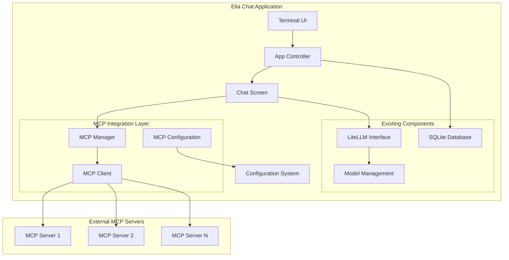

# MCP Support Design Document

## Overview

This design document outlines the integration of Model Context Protocol (MCP) support into Elia Chat. MCP is an open-source standard that enables AI applications to connect to external systems, tools, and data sources. The integration will allow Elia Chat users to extend their language model conversations with external capabilities while maintaining the application's existing architecture and user experience.

The implementation follows a modular approach, adding MCP functionality as an optional feature that doesn't disrupt existing workflows. When MCP servers are configured, they provide additional tools and resources that language models can use during conversations.

## Architecture

### High-Level Architecture



### Component Integration

The MCP integration is designed to work seamlessly with Elia Chat's existing architecture:

1. **Configuration Layer**: MCP configuration is handled separately from the main TOML config using a JSON file
2. **Manager Layer**: The MCP Manager coordinates multiple MCP clients and integrates with the chat flow
3. **Client Layer**: Individual MCP clients handle connections to specific MCP servers
4. **UI Integration**: MCP status and tool usage are displayed within the existing terminal interface

## Components and Interfaces

### MCP Configuration (`mcp_config.py`)

Handles loading and validation of MCP server configurations from JSON files. The MCP configuration file (`mcp.json`) is located in the same directory as the main Elia configuration file, using the XDG config directory structure:

- **Location**: `~/.config/elia/mcp.json` (Linux/macOS) or equivalent XDG config directory
- **Format**: JSON file containing MCP server configurations
- **Optional**: If the file doesn't exist, MCP features are disabled

```python
from pydantic import BaseModel, Field
from typing import Dict, List, Optional, Any
from pathlib import Path

class MCPServerConfig(BaseModel):
    """Configuration for a single MCP server."""
    command: str
    args: List[str] = Field(default_factory=list)
    env: Dict[str, str] = Field(default_factory=dict)
    disabled: bool = False
    auto_approve: List[str] = Field(default_factory=list)
    """List of tool names that can be executed without user confirmation.
    Empty list means all tools require confirmation. Use with caution for security."""
    timeout: int = 30
    
class MCPConfig(BaseModel):
    """Complete MCP configuration."""
    mcp_servers: Dict[str, MCPServerConfig] = Field(default_factory=dict)
    
    @classmethod
    def load_from_file(cls, config_path: Path) -> "MCPConfig":
        """Load MCP configuration from JSON file."""
        # Implementation details
        
    @classmethod
    def load_default(cls) -> "MCPConfig":
        """Load MCP configuration from default location."""
        from elia_chat.locations import config_directory
        config_path = config_directory() / "mcp.json"
        if config_path.exists():
            return cls.load_from_file(config_path)
        return cls()  # Return empty config if file doesn't exist
        
    def get_enabled_servers(self) -> Dict[str, MCPServerConfig]:
        """Return only enabled MCP servers."""
        # Implementation details
```

### MCP Client (`mcp_client.py`)

Manages connection to individual MCP servers and handles tool execution.

```python
from typing import Optional, List, Dict, Any
import asyncio
from contextlib import asynccontextmanager

class MCPClient:
    """Client for connecting to and communicating with MCP servers."""
    
    def __init__(self, server_name: str, config: MCPServerConfig):
        self.server_name = server_name
        self.config = config
        self.connection = None
        self.tools = []
        self.connected = False
        
    async def connect(self) -> bool:
        """Establish connection to MCP server."""
        # Implementation details
        
    async def disconnect(self):
        """Close connection to MCP server."""
        # Implementation details
        
    async def list_tools(self) -> List[Dict[str, Any]]:
        """Get available tools from MCP server."""
        # Implementation details
        
    async def call_tool(self, tool_name: str, arguments: Dict[str, Any]) -> Dict[str, Any]:
        """Execute a tool on the MCP server."""
        # Implementation details
        
    @property
    def status(self) -> str:
        """Get current connection status."""
        return "connected" if self.connected else "disconnected"
```

### MCP Manager (`mcp_manager.py`)

Coordinates multiple MCP clients and integrates with the chat system.

```python
from typing import Dict, List, Optional, Any
from elia_chat.mcp.mcp_client import MCPClient
from elia_chat.mcp.mcp_config import MCPConfig

class MCPManager:
    """Manages multiple MCP clients and coordinates tool execution."""
    
    def __init__(self, config: MCPConfig):
        self.config = config
        self.clients: Dict[str, MCPClient] = {}
        self.all_tools: List[Dict[str, Any]] = []
        
    async def initialize(self):
        """Initialize all configured MCP clients."""
        # Implementation details
        
    async def shutdown(self):
        """Shutdown all MCP clients."""
        # Implementation details
        
    async def get_available_tools(self) -> List[Dict[str, Any]]:
        """Get all available tools from all connected servers."""
        # Implementation details
        
    async def execute_tool(self, tool_name: str, arguments: Dict[str, Any]) -> Dict[str, Any]:
        """Execute a tool, finding the appropriate server."""
        # Implementation details
        
    async def is_tool_auto_approved(self, server_name: str, tool_name: str) -> bool:
        """Check if a tool is in the auto-approve list for its server."""
        # Implementation details
        
    def get_server_status(self) -> Dict[str, str]:
        """Get status of all MCP servers."""
        # Implementation details
        
    async def handle_tool_calls(self, tool_calls: List[Dict[str, Any]]) -> List[Dict[str, Any]]:
        """Handle multiple tool calls from language model."""
        # Implementation details
```

### Integration with LiteLLM

The MCP integration extends the existing LiteLLM interface to support tool calls:

```python
# In existing chat handling code
async def process_message_with_mcp(self, message: str, model: EliaChatModel) -> str:
    """Process a message with MCP tool support."""
    
    # Get available MCP tools
    mcp_tools = await self.mcp_manager.get_available_tools()
    
    # Prepare LiteLLM call with tools
    response = await litellm.acompletion(
        model=model.name,
        messages=conversation_history,
        tools=mcp_tools,  # Pass MCP tools to model
        tool_choice="auto"
    )
    
    # Handle tool calls if present
    if response.choices[0].message.tool_calls:
        tool_results = await self.mcp_manager.handle_tool_calls(
            response.choices[0].message.tool_calls
        )
        
        # Continue conversation with tool results
        # Implementation details
        
    return response.choices[0].message.content
```

## Data Models

### MCP Tool Representation

MCP tools are represented in a format compatible with LiteLLM's tool calling interface:

```python
{
    "type": "function",
    "function": {
        "name": "tool_name",
        "description": "Tool description from MCP server",
        "parameters": {
            "type": "object",
            "properties": {
                # Parameter schema from MCP server
            },
            "required": ["param1", "param2"]
        }
    }
}
```

### Tool Call Results

Tool execution results follow the standard format:

```python
{
    "tool_call_id": "call_123",
    "role": "tool",
    "name": "tool_name",
    "content": "Tool execution result"
}
```

### Configuration Schema

The MCP configuration JSON schema is stored at `~/.config/elia/mcp.json`:

```json
{
  "mcp_servers": {
    "aws-docs": {
      "command": "uvx",
      "args": ["awslabs.aws-documentation-mcp-server@latest"],
      "env": {
        "FASTMCP_LOG_LEVEL": "ERROR"
      },
      "disabled": false,
      "auto_approve": [],
      "timeout": 30
    },
    "calculator": {
      "command": "python",
      "args": ["path/to/calculator_server.py"],
      "env": {},
      "disabled": false,
      "auto_approve": ["add", "subtract"],
      "timeout": 10
    }
  }
}
```

**Configuration Location Details:**
- **File Path**: Uses Elia's existing XDG config directory (`~/.config/elia/mcp.json`)
- **Creation**: File is created automatically when first MCP server is configured
- **Validation**: Configuration is validated on application startup
- **Fallback**: If file is missing or invalid, MCP features are disabled gracefully

**Configuration Field Details:**
- **auto_approve**: List of tool names that can be executed automatically without user confirmation
  - Empty list (default): All tools require user approval before execution
  - Specific tools: Only listed tools are auto-approved (e.g., `["add", "subtract"]`)
  - Security consideration: Use carefully as auto-approved tools execute without user oversight
- **timeout**: Maximum seconds to wait for tool execution before timing out
- **disabled**: Set to `true` to disable this MCP server without removing its configuration

## Error Handling

### Connection Errors

- **Server Unavailable**: Log error, continue with other servers, show status in UI
- **Configuration Invalid**: Show clear error message, prevent startup if critical
- **Network Issues**: Implement retry logic with exponential backoff

### Tool Execution Errors

- **Tool Not Found**: Return error message to language model
- **Invalid Arguments**: Validate arguments before sending to server
- **Timeout**: Cancel operation, return timeout error to model
- **Server Error**: Log error, return formatted error message to model

### Graceful Degradation

- If no MCP servers are configured, the application works normally
- If all MCP servers fail, conversations continue without tool support
- Individual server failures don't affect other servers or core functionality

## Testing Strategy

### Unit Tests

- **Configuration Loading**: Test JSON parsing, validation, error handling
- **MCP Client**: Test connection, tool listing, tool execution
- **MCP Manager**: Test multi-client coordination, tool routing
- **Integration**: Test LiteLLM integration, message flow

### Integration Tests

- **End-to-End Tool Calls**: Test complete flow from user message to tool execution
- **Multiple Servers**: Test coordination between multiple MCP servers
- **Error Scenarios**: Test various failure modes and recovery

### Manual Testing

- **Configuration**: Test various MCP server configurations
- **UI Integration**: Test status display, error messages
- **Performance**: Test with multiple servers and concurrent tool calls

### Test MCP Server

Create a simple test MCP server for development and testing:

```python
# test_mcp_server.py
from mcp.server import FastMCP

mcp = FastMCP("Test Calculator Server")

@mcp.tool(description="Add two numbers")
def add(x: int, y: int) -> int:
    return x + y

@mcp.tool(description="Get current time")
def get_time() -> str:
    import datetime
    return datetime.datetime.now().isoformat()

if __name__ == "__main__":
    mcp.run(transport="stdio")
```

## Security Considerations

### Tool Execution Safety

- **Tool Approval Workflow**: By default, all MCP tools require user confirmation before execution
- **Auto-Approval**: Only tools explicitly listed in `auto_approve` can execute without confirmation
- **Argument Validation**: Validate all tool arguments before execution
- **Timeouts**: Implement timeouts to prevent hanging operations
- **Audit Logging**: Log all tool executions for security audit purposes
- **Sandboxing**: Consider sandboxing for untrusted MCP servers

### Tool Approval Flow

1. Language model requests tool execution
2. Check if tool is in server's `auto_approve` list
3. If auto-approved: Execute immediately
4. If not auto-approved: Show confirmation dialog to user
5. User approves/denies tool execution
6. Execute tool if approved, return error if denied

### Configuration Security

- Validate MCP server configurations
- Secure storage of sensitive environment variables
- Limit which tools can be auto-approved
- Provide clear warnings for potentially dangerous tools

### Network Security

- Support secure connections (HTTPS, WSS) for network-based MCP servers
- Validate server certificates
- Implement rate limiting for tool calls
- Consider authentication mechanisms for MCP servers

## Performance Considerations

### Connection Management

- Use connection pooling for HTTP-based MCP servers
- Implement connection keep-alive for long-running sessions
- Handle connection failures gracefully with automatic reconnection

### Tool Execution

- Implement concurrent tool execution where possible
- Cache tool schemas to avoid repeated discovery calls
- Set reasonable timeouts for tool operations
- Monitor and log performance metrics

### Memory Management

- Limit the number of concurrent MCP connections
- Clean up resources when servers are disabled
- Monitor memory usage of MCP client processes

## Future Enhancements

### Advanced Features

- **Tool Approval Workflow**: Interactive approval for sensitive tools
- **Tool Usage Analytics**: Track which tools are used most frequently
- **Custom Tool Categories**: Group tools by functionality in UI
- **Tool Chaining**: Support for complex multi-tool workflows

### UI Improvements

- **Visual Tool Indicators**: Show when tools are being executed
- **Tool Result Formatting**: Better display of tool results in chat
- **Server Management UI**: In-app configuration of MCP servers
- **Tool Documentation**: Show tool descriptions and usage examples

### Integration Enhancements

- **Streaming Tool Results**: Support for streaming tool outputs
- **Tool Result Caching**: Cache results for expensive operations
- **Conditional Tool Access**: Enable/disable tools based on context
- **Tool Permissions**: Fine-grained control over tool access